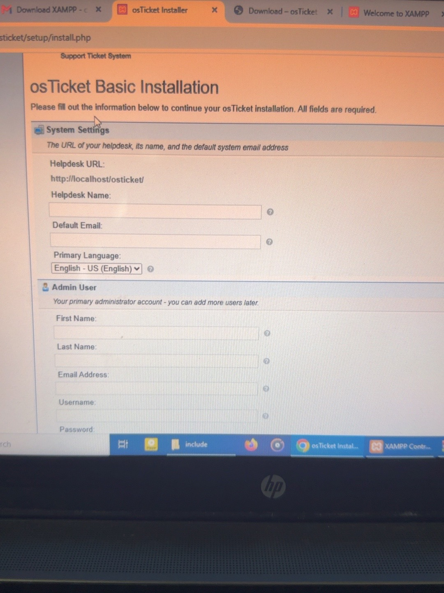
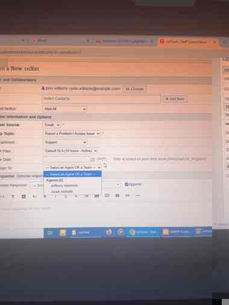
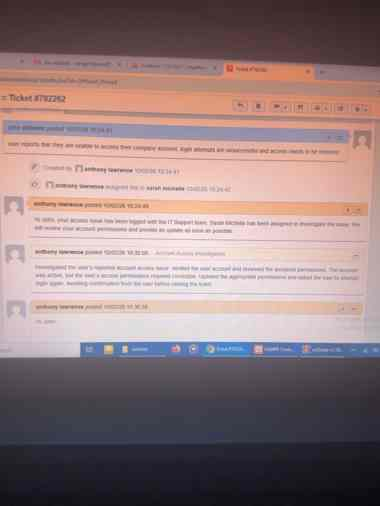
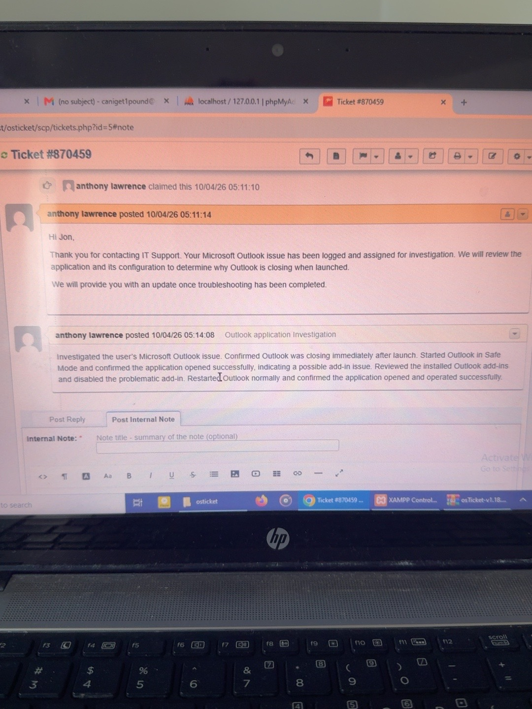
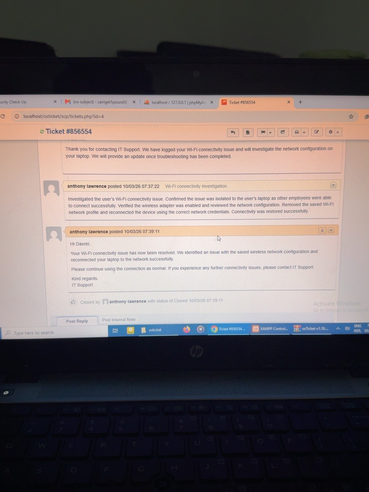
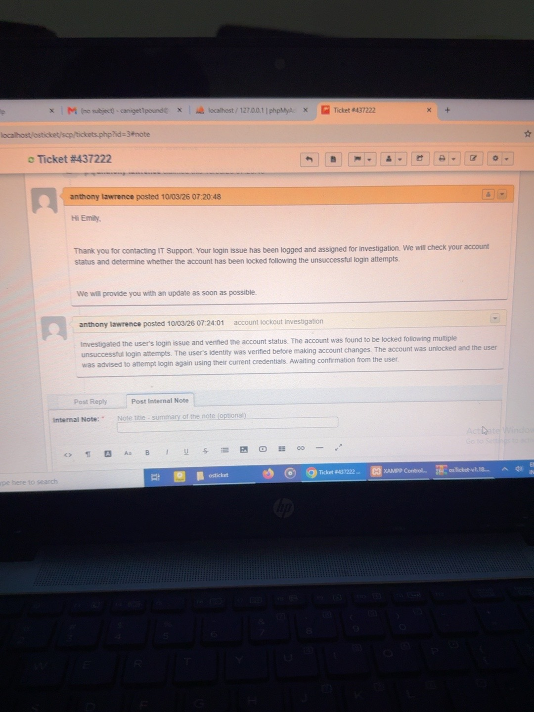
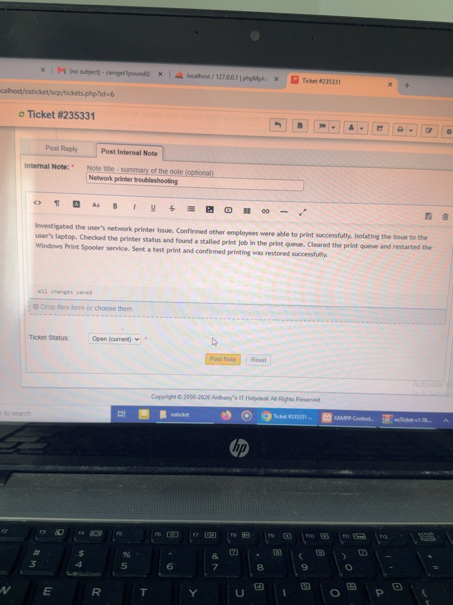
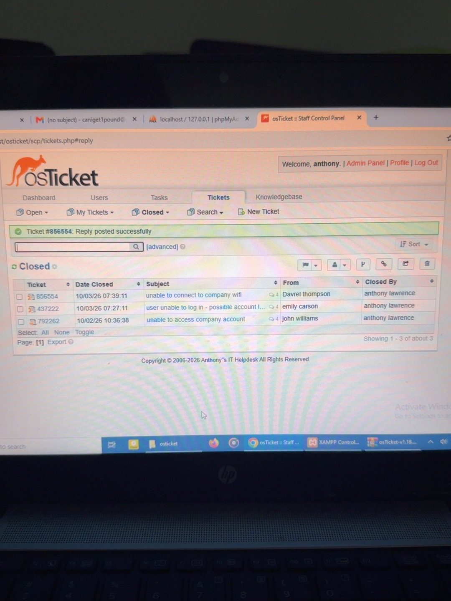

# osTicket Help Desk Lab

A practical IT support portfolio project using **osTicket** to simulate a small help desk environment and demonstrate the full support lifecycle from ticket intake through troubleshooting, communication, resolution, and closure.

## Project Highlights

- Built and configured a local osTicket help desk environment
- Created users, agents, departments, roles, priorities, and SLA handling
- Worked through **5 realistic support scenarios**
- Practised ticket triage, assignment, troubleshooting, internal notes, user communication, and closure
- Documented evidence for account access, account lockout, Wi-Fi, Outlook, and printer issues
- Demonstrated entry-level **Help Desk / IT Support** workflow and documentation skills

## Key Skills

**osTicket · Ticket Management · Troubleshooting · SLA Awareness · User Support · Windows Support · Wi-Fi · Microsoft Outlook · Print Spooler · Technical Documentation · Customer Communication**

> **Lab scope:** The users, incidents, troubleshooting actions, and resolutions in this repository are simulated training scenarios created in a local lab environment. They are not records from a real employer or production help desk.

## Project Overview

This project was created to practise entry-level IT support and help desk skills using a real ticketing platform. The environment was configured locally and then used to create users, agents, departments, SLAs, tickets, internal notes, customer-facing responses, and ticket closures.

The workflow practised throughout the lab was:

**User issue → ticket creation → categorisation → prioritisation → assignment → troubleshooting → internal documentation → user communication → resolution → closure**

## Lab Environment

| Component | Purpose |
|---|---|
| Windows 10 | Local host operating system |
| XAMPP | Local Apache / database / PHP stack |
| phpMyAdmin | Database administration |
| osTicket 1.18.4 | Help desk / ticketing platform |
| MySQL / MariaDB | osTicket database |
| Web browser | Staff and admin portal access |

The lab runs locally through `localhost` and is used only for training.

## Configuration Completed

- Installed and configured osTicket
- Created the osTicket database and database user
- Configured database privileges
- Secured the post-install configuration
- Removed the setup directory after installation
- Configured the help desk name and support department
- Created agent accounts and access roles
- Configured ticket priorities and SLA handling
- Created test users/customers
- Created, assigned, investigated, documented, resolved, and closed support tickets

## Ticket Scenarios

### 1. Account Access / Permissions Issue
A user was unable to access their company account. The ticket documented account and permission review, corrective action, user communication, and closure.

### 2. Account Lockout
A user was locked out after multiple unsuccessful login attempts. The workflow included identity verification, account-status checks, unlocking the account, documenting the action, and closing the ticket.

### 3. Wi-Fi Connectivity Issue
A single laptop could see the company wireless network but could not connect while other employees were unaffected. The scenario documented issue isolation, wireless-adapter checks, removal of the saved Wi-Fi profile, reconnection, and validation.

### 4. Microsoft Outlook Startup Issue
Microsoft Outlook opened briefly and then closed. The scenario used Safe Mode to isolate the fault to an add-in, disabled the problematic add-in, retested Outlook, documented the fix, and closed the ticket.

### 5. Network Printer Issue
Print jobs remained stuck in the queue while other employees could print normally. The scenario documented fault isolation, clearing the print queue, restarting the Windows Print Spooler service, performing a test print, and closing the ticket.

## Skills Demonstrated

- Help desk ticket lifecycle management
- Ticket categorisation and prioritisation
- SLA awareness
- User and agent administration
- Department and role configuration
- Windows account-support concepts
- Wi-Fi troubleshooting
- Microsoft Outlook troubleshooting
- Printer and Print Spooler troubleshooting
- Fault isolation
- Internal technical documentation
- Customer-facing communication
- Escalation and resolution thinking
- Professional ticket closure

## Evidence

The screenshots below document the project from initial setup through ticket handling, troubleshooting, and closure.

### 1. osTicket Installation

### 2. Agent Access Configuration

### 3. Ticket Creation Workflow

### 4. Account Access Ticket Workflow

### 5. Outlook Application Investigation

### 6. Wi-Fi Connectivity Resolution

### 7. Account Lockout Investigation

### 8. Network Printer Troubleshooting

### 9. Closed Tickets Overview

For a concise written summary of the support scenarios, see `docs/ticket-scenarios.md`.

## What I Learned

This lab reinforced that help desk work is not only about finding a technical fix. A complete support workflow also requires gathering the right information, selecting an appropriate priority, keeping the user informed, recording troubleshooting steps clearly, validating the resolution, and closing the ticket with useful documentation.

## Disclaimer

This repository documents a personal training lab. All names, users, incidents, and support scenarios are fictional or simulated for educational purposes.
